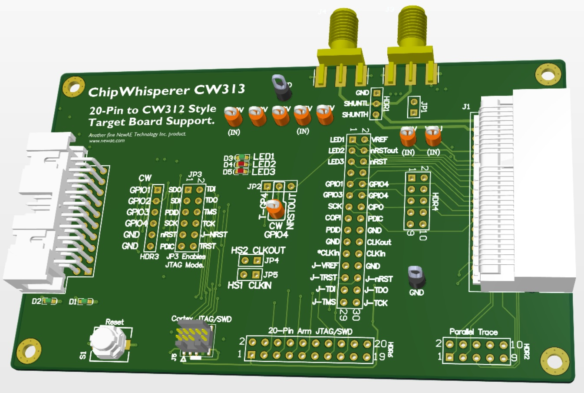

# ChipWhisperer CW313 - 20-Pin to Card Edge (CW312 Style) Breakout/Adapter Board

The CW313 board is part of a standard ChipWhisperer-Husky build-out. It contains some of the
functionality of the original CW308 board, but at a much lower price-point. It also uses the
cost-optimized CW312 card edge connector.

## Features

Like the CW308, the CW313 contains some support circuitry for the target boards. This includes:

* Power supplies (1.2V, 1.8V, 3.3V only)
* Pin headers for scoping various signals
* 20-pin JTAG header for debug with most targets
* Reset pushbutton

Some specific header configurations that are new on the CW313 include:

* Route JTAG from ChipWhisperer (using OpenOCD) to JTAG pins on target boards.
* Access ETM trace signals (requires custom cable still)
* Route RSTOUT to trigger input (typically GPIO4 on ChipWhisperer)

Note the following features are **not support** on the CW313 that the CW308 has:

* No XTAL socket & driver circuit
* No clamping diodes on all I/O lines
* No 2.5V regulator, No adjustable regulator
* No DC barrel jack input

These are planned to be on the (eventual) CW312 board, which has not yet been designed.

## Using the CW313

### SMA Connectors

Two SMA connectors on the board can be used for power measurement or glitch input. These
connectors are wired together, there is no difference between them.

### Filter

### Trigger Setting

JP2 allows you to select the signal that is routed to ChipWhisperer GPIO4 pin (normally this
is the trigger input). You can choose to route either:

* Target GPIO4 pin (this is default setup)
* nRSTOUT (connected to nRST on targets without nRSTOUT)

The use of nRSTOUT allows you to trigger on the reset sequence of the chip. Some devices provide
a "reset out" that more accurately reflects when the chip comes out of reset than the reset
input.

### JTAG Connections

#### Arm 20-pin JTAG Header

`HDR6` has a standard 20-pin Arm JTAG header. This can be used for JTAG or SWD depending on the
target.

#### Arm Cortex Header

`J5` is a 0.05" Arm Cotex-M header that can be used for JTAG or SWD depending on the target.

#### ETM Trace Connections

`HDR2` has pins which connect the parallel trace signals (TRACED0..3 + TRACECLK). Usage of trace
may require an additional adapter.

#### ChipWhisperer JTAG (with OpenOCD)

The ChipWhisperer supports JTAG via FTDI compatability mode with OpenOCD. The normally ChipWhisperer
signals which provide the JTAG can be bridged to the target signals by mounting the headers across
JP3.

### Power Supplies

The board uses the 3.3V supply from the ChipWhisperer. It also has a 1.8V and 1.2V LDO regulator
to provide these power supplies to a target.

There is no 1.0V or 2.5V regulator, but those test points are available. You can connect an external
bench power supply if you need those voltages.